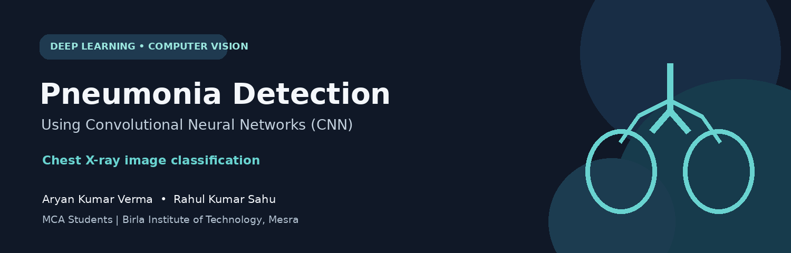
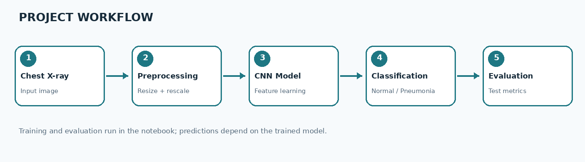

# Pneumonia Detection Using CNN

### Chest X-ray image classification with Deep Learning

**A student project by Aryan Kumar Verma and Rahul Kumar Sahu**\
*MCA Students · Birla Institute of Technology (BIT), Mesra*
:::

------------------------------------------------------------------------

## Overview

This project explores how a **Convolutional Neural Network (CNN)** can
classify chest X-ray images into two categories: **Normal** and
**Pneumonia**. The notebook covers dataset loading, image preprocessing,
CNN training, training-history visualization, model saving, and
evaluation on a separate test set.

> **Medical disclaimer:** This is an educational machine-learning
> project, not a clinically validated diagnostic system. Do not use it
> to diagnose, treat, or rule out pneumonia.

## Project workflow



1.  **Load data** from the train, validation, and test folders.
2.  **Preprocess images** by resizing them and scaling pixel values.
3.  **Train the CNN** to learn visual features from labelled chest
    X-rays.
4.  **Classify images** as Normal or Pneumonia.
5.  **Evaluate the model** on held-out test data using metrics generated
    by the notebook.

## Features

-   Chest X-ray image classification using a CNN.
-   Image resizing and pixel-value normalization.
-   Training and validation workflow.
-   Loss and accuracy plots.
-   Saved Keras model for reuse.
-   Test-set evaluation, including classification metrics and a
    confusion matrix in the corrected notebook.
-   Optional Streamlit interface for image upload and prediction, if you
    include the app file.

## Technology stack

  -----------------------------------------------------------------------
  Technology                          Purpose
  ----------------------------------- -----------------------------------
  Python                              Main programming language

  TensorFlow / Keras                  Build and train the CNN

  NumPy                               Numerical operations and arrays

  Matplotlib                          Visualize images and training
                                      history

  scikit-learn                        Evaluation metrics and confusion
                                      matrix

  Pillow                              Image loading and preprocessing

  Jupyter Notebook                    Interactive development

  Streamlit *(optional)*              Web interface for image upload and
                                      prediction
  -----------------------------------------------------------------------

## Dataset

The project uses the **Chest X-Ray Images (Pneumonia)** dataset.

-   **Dataset:** [Kaggle --- Chest X-Ray Images
    (Pneumonia)](https://www.kaggle.com/datasets/paultimothymooney/chest-xray-pneumonia)
-   Download and extract the dataset locally.
-   Keep the original train, validation, and test splits separate. Do
    not move test images into training.

Expected folder structure:

``` text
chest_xray/
├── train/
│   ├── NORMAL/
│   └── PNEUMONIA/
├── val/
│   ├── NORMAL/
│   └── PNEUMONIA/
└── test/
    ├── NORMAL/
    └── PNEUMONIA/
```

Configure the notebook's dataset-root setting to point to the
`chest_xray` directory on your computer.

## How the CNN works

The network uses convolution and pooling layers to learn image features,
followed by dense layers for binary classification.

-   **Convolution:** learns local patterns such as edges and textures.
-   **Pooling:** reduces feature-map dimensions.
-   **Flatten / Dense layers:** combine learned features for
    classification.
-   **Sigmoid output:** for a single-output model, produces a score
    between 0 and 1 for the positive class.

## Installation

``` bash
python -m pip install --upgrade pip
python -m pip install tensorflow numpy matplotlib scikit-learn pillow jupyter
```

For the optional Streamlit interface:

``` bash
python -m pip install streamlit
```

## Run the notebook

1.  Clone or download this repository.

2.  Download and extract the dataset using the structure above.

3.  Open a terminal in the project directory.

4.  Start Jupyter:

    ``` bash
    jupyter notebook
    ```

5.  Open `Pneumonia_detection_using_CNN_corrected.ipynb`.

6.  Update the dataset path if needed.

7.  Run the cells from top to bottom.

Training may take time and can benefit from a GPU. Actual evaluation
results will appear when the notebook runs; **this README does not claim
a specific accuracy**.

## Optional: run the Streamlit app

If you include the Streamlit application and have trained the model,
place `trained.h5` where the app expects it, then run:

``` bash
python -m streamlit run app.py
```

Upload a supported chest X-ray image (JPG/JPEG/PNG) to view the model's
output. Ensure the app's class order and preprocessing match the
settings used during training.

## Repository structure

``` text
.
├── Pneumonia_detection_using_CNN_corrected.ipynb
├── app.py                   # optional Streamlit interface
├── trained.h5               # generated after training; usually not committed
├── chest_xray/               # dataset; download separately
├── assets/
│   ├── project-banner.png
│   └── project-workflow.png
└── README.md
```

**Tip:** Large datasets and model files may exceed GitHub's ordinary
file limits. Consider excluding them from Git and adding these entries
to `.gitignore`:

``` gitignore
chest_xray/
trained.h5
.keras/
__pycache__/
.ipynb_checkpoints/
.venv/
venv/
```

## Evaluation

Use the held-out test split to assess generalization. Review more than
accuracy alone:

-   **Precision:** among images predicted as Pneumonia, the proportion
    labelled Pneumonia.
-   **Recall / sensitivity:** among images labelled Pneumonia, the
    proportion identified by the model.
-   **Specificity:** among Normal images, the proportion correctly
    identified.
-   **F1-score:** combines precision and recall.
-   **Confusion matrix:** summarizes correct and incorrect predictions
    by class.

Results depend on the dataset and training configuration. Report the
metrics produced by your own run; validation performance is not a
substitute for final test evaluation.

## Limitations and responsible use

-   Performance may not generalize to different hospitals, scanners,
    image quality, or patient populations.
-   Other conditions may produce similar X-ray patterns.
-   False positives and false negatives are possible.
-   Model confidence is not the same as clinical certainty.
-   Medical decisions should be made by qualified healthcare
    professionals using appropriate clinical information.

## Contributors

  Name                    Affiliation
  ----------------------- ------------------------
  **Aryan Kumar Verma**   MCA Student, BIT Mesra
  **Rahul Kumar Sahu**    MCA Student, BIT Mesra

## Acknowledgements

-   The creators of the [Chest X-Ray Images (Pneumonia)
    dataset](https://www.kaggle.com/datasets/paultimothymooney/chest-xray-pneumonia).
-   The open-source Python, TensorFlow/Keras, Jupyter, and
    scientific-computing communities.

------------------------------------------------------------------------

**Made as an MCA academic project at BIT Mesra**

If you find this project useful for learning, consider giving the
repository a ⭐.
:::
